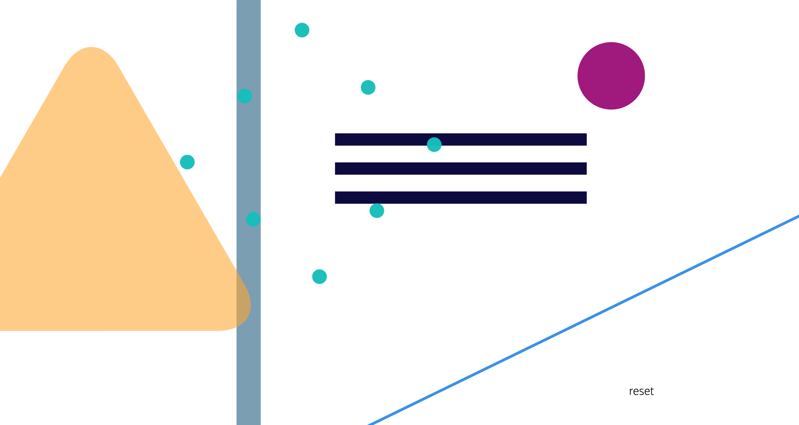
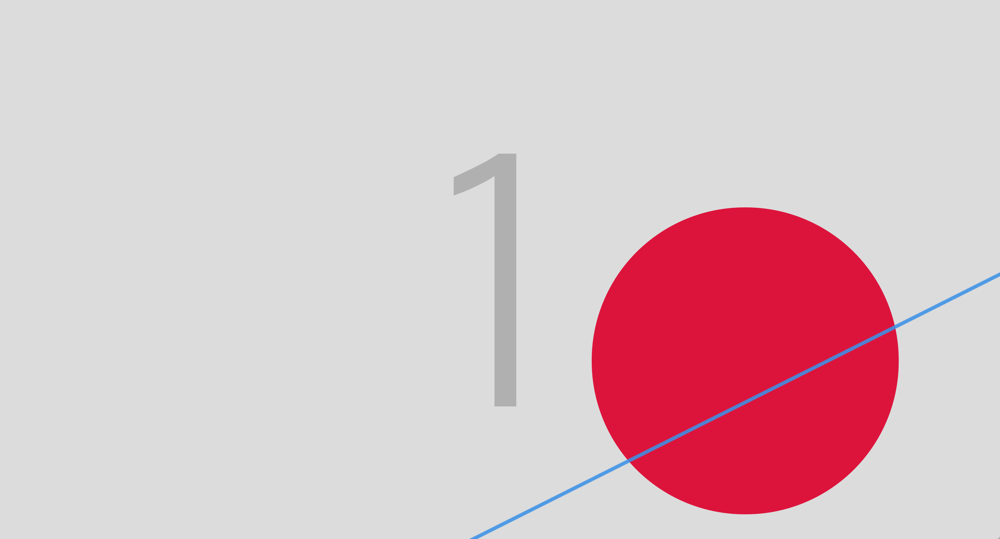
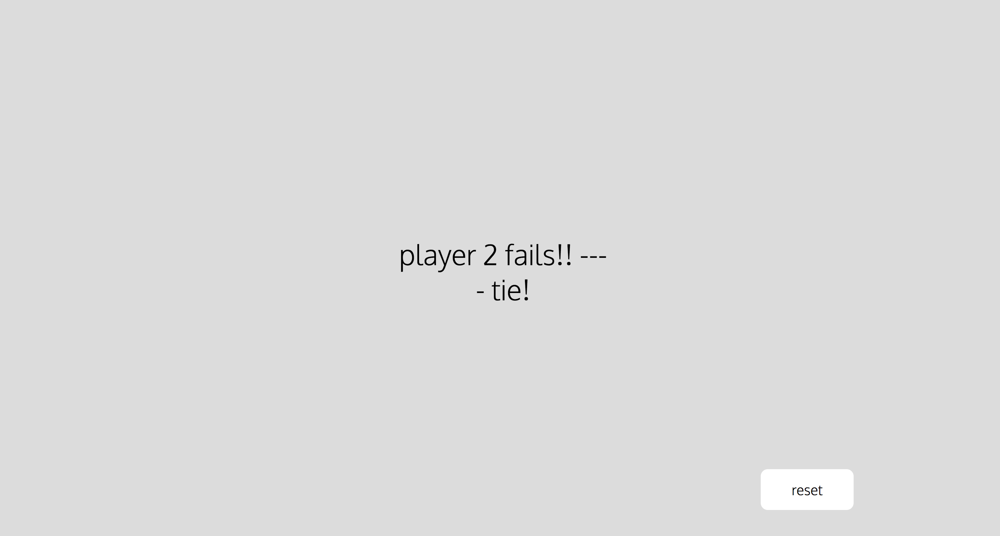
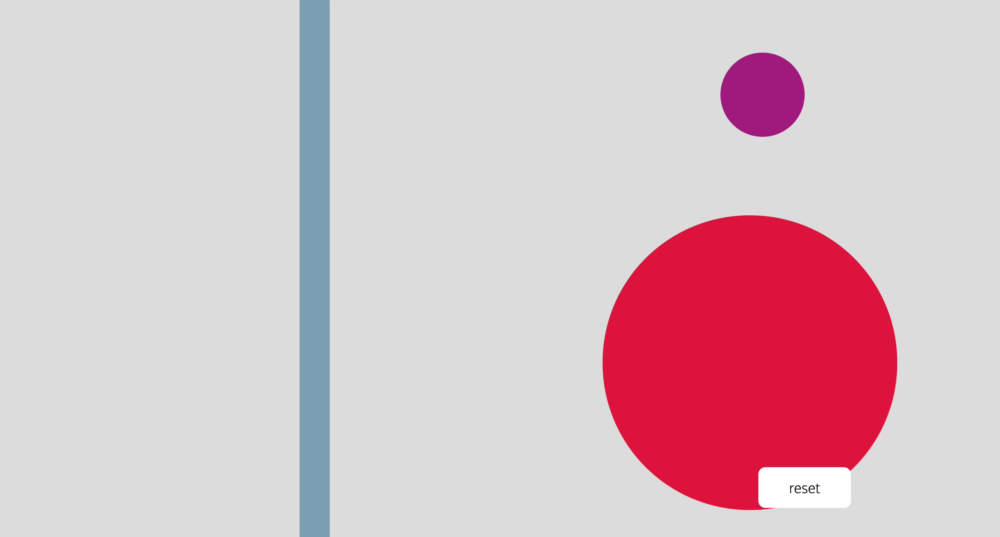
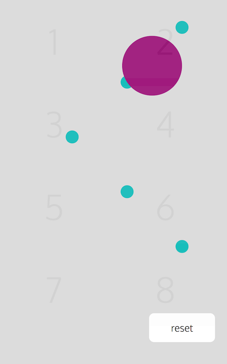

#Soundboard
##sound based memory game

### installation and setup

To run the code,

* visit the project 0 github repository.
* Hit 'clone or download'.
* Using your terminal, run the NPM i comand to install the dependencies needed.
* Run Gulp to compile the  Source Code.
* Note- You will need to have 'gulp -cli' installed globally. 

### The Game

Soundboard is a multiplayer sound memory game. Trigger sounds and animations to test your memory, playing against the computer and a friend. 

### How to play- 
As the game begins, the computer will play a sequence of sounds and animations to match. Player 1 must then repeat the sequence using keys 1-8. The animations are accompanied by large numbers on screen to help the players learn which sound each number corresponds to. 

If player 1 successfully repeats the sequence, the next round begins and it's player 2's turn. The game progressively becomes more challenging as the rounds increase until there is a player faulters. At which point there is a repeat of the last round for the opposing player to attempt, winning or loosing this 'sudden death' round results in a win or tie respectively.

Playground mode is a empty space mode, allowing the user to have have fun with the sounds and get used to what each button does.

There is also a 'hard mode' which removes the number guidance from the screen. 

### Technologies Used 

Software languages used-

* HTML 5
* SCSS
* Javascript ES6
* Jquery 3.10
* Gulp
* NPM
* Git & Git Hub

### Challenges faced
One of the plroblems faced when putting this project together was getting the animations to retrigger on every keypress. By default, the animation would only play again once it has finished it's first iteration, and any subsequent presses will interupt the first play. 

The solution was to clone and then append the element to the main tag, then animate the clone instead of the original element. This allows as many clones as needed to be made and animated on muliutple keypresses, which are then deleted when the animation is finished. 

Another Challenge was making the game mobile compatible. With the lack of keys to press on tablets and phones, I needed a solution to allow mobile users to play. This came in the form of 8 large buttons spread accross the screen with a low opacity setting. This effectively created a target sensitive area which triggered the sounds according to which area of the screen was pressed.

### Improvements
In the future more functionality could be added to the game to improve the user experience. A timer on the rounds would add some more value and visual feedback, and perhaps swapping out the CSS animations for some Javascript ones would give with an overall more professional feel.

The game experience would also be improved greatly by making the sounds polyphonic- in it's current state one sound can becut off by the next. Doing so would likely involve assinging an audio tag to each sound, rather than all the sounds sharing one tag, as is currently the case.

Though the game is reponsive to ipad, more functionality with phone size screens is also needed. 
