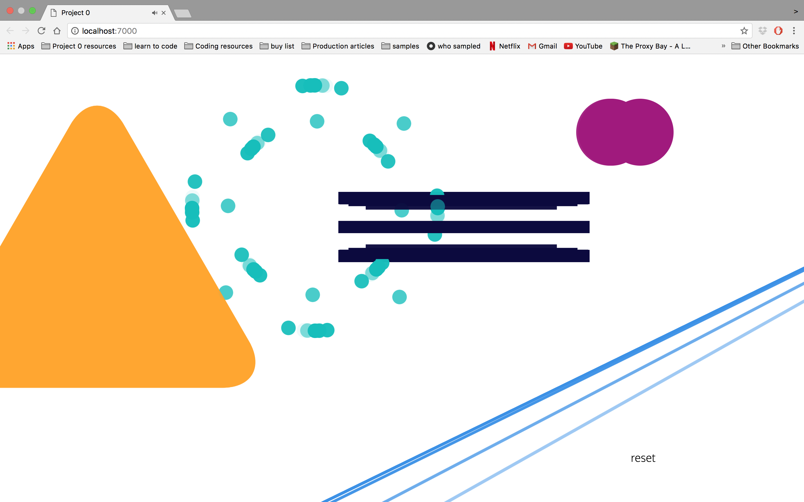

#Soundboard
##sound based memory game
### installation and setup

To run the code,

* visit the project 0 github repository.
* Hit 'clone or download'.
* Using your terminal, run the NPM i comand to install the dependencies needed.
* Run Gulp to compile the  Source Code.
* Note- You will need to have 'gulp -cli' installed globally. 

### The Game

Soundboard is a sound and animation based memory game for two players. Sounds and accompanying animations are triggered when the user presses keys 1-9 during the 'game' or 'playground' modes. 

Game mode- the players wait for a randomly generated sequence of sounds from the computer to be played and must repeat the sequence to progress to the next round, which increases in difficulty. 

Playground mode is a empty space mode, allowing the user to have have fun with the sounds and get used to what each button does.

There is also an 'easy mode' which shows the user the relevant numbers for each sound to play in the correct order.

### Technologies Used 

Software languages used-

* HTML 5
* SCSS
* Javascript ES6
* Jquery 3.10
* Gulp
* NPM
* Git & Git Hub

### Challenges faced
One of the plroblems faced when putting this project together was writing the animations dynamically enough to retrigger on every keypress. By default, the animation will only play again once it has finished it's first iteration, and any subsequent presses will interupt the first play. The solution was to clone the div element to be animated, append it to the 'main' HTML tag, animate it, and then remove the clone once the animation is complete. 

Another challenge was writing in the 'Sudden Death' round, a round in which the second player can have an attempt after the first has failed to repeat the sequence corrently. This presented a challenge as the round and current player needed to change, without the difficulty increasing as it would do normally. The solution came in the form of a large if-else statement, with another nested inside it.

### Improvements
Though I am proud of the game, in the future I wish to add a bit more functionality to it. A timer on the user rounds would add some more complexity, and perhaps swapping out the CSS animations for some Javascript ones would help with an overall more professional feel.

The game experience would also be improved greatly by making the sounds polyphonic- in it's current state one sound is cut off by the next if pressed in quick succession. 

Though the game is reponsive to ipad, more functionality with phone size screens is also needed. 
